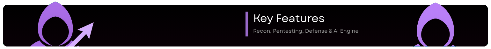

<div align="center">
  

  # PurpleTeamAI
  
  **AI-Powered Security Operations Platform with Multi-Tiered Sidecar Architecture**

  
  
  
  
  
  
  
  [](https://www.python.org/)
  [](https://reactjs.org/)
  [](https://www.electronjs.org/)
  [](https://www.langchain.com/)

  ---

  ### [START HERE](./START_HERE.md) - New to this project? Begin here!

  ---

</div>

> [!IMPORTANT]
> **Dissertation Project**: This application is being developed as part of a final year dissertation for the Cybersecurity and Digital Forensics course.
>
> **Current Status**: Planning phase complete - ready to begin implementation

PurpleTeamAI is a next-generation security operations platform that unifies reconnaissance, red teaming (offensive), and blue teaming (defensive) operations into a single, AI-powered desktop application. Built on a secure multi-tiered "Sidecar" architecture, it combines the power of Electron.js for the interface, Python for system-level security tools, and LangChain with GPT-4o/Ollama for intelligent analysis.

This project bridges the gap between attackers and defenders by integrating these distinct disciplines into one cohesive platform. It covers the entire security lifecycle from reconnaissance to pentesting and active defense, demonstrating how Artificial Intelligence can revolutionize vulnerability analysis, threat detection, and automated remediation through Large Language Models (LLMs).

## Architecture Overview



PurpleTeamAI employs a **Multi-Tiered "Sidecar" Architecture** designed for security, performance, and AI integration:

### Orchestration Layer: Electron.js + React + Tailwind
- **Secure IPC Bridge** with Context Isolation to prevent RCE from tool outputs
- Modern, responsive UI built with React 18 and Tailwind CSS
- Real-time updates and interactive dashboards
- Cross-platform desktop application (Windows, macOS, Linux)

### Execution Layer: Python Sidecar
- System-level security tool integration (Nmap, Sublist3r, Scapy, SQLMap)
- Isolated process execution for enhanced security
- "LLM-Ready" data normalization for raw tool outputs
- Communication via secure local socket or child process

### Reasoning Layer: LangChain + GPT-4o/Ollama
- Semantic analysis of security findings
- Automated MITRE ATT&CK and OWASP Top 10 mapping
- Risk scoring algorithms based on vulnerability severity
- Natural language report generation for stakeholders

## Key Features

### Reconnaissance Module
- Automated subdomain enumeration and port scanning
- Attack surface mapping and visualization
- OSINT data aggregation from multiple sources
- LLM-powered analysis of reconnaissance data

### Pentesting Module (Red Team)
- Integrated vulnerability scanners (SQLi, XSS, etc.)
- Automated mapping to OWASP Top 10 and MITRE ATT&CK
- AI-driven logic flaw identification
- Exploit suggestion and attack path analysis

### Defense Module (Blue Team)
- Real-time threat monitoring and log analysis
- Alert fatigue reduction through intelligent log condensation
- **AI-Driven Auto-Remediation**: Automated patch generation and fix suggestions
- Security compliance checking against industry benchmarks

### AI Engine
- Multi-model support: GPT-4o, Ollama (local Llama models)
- Intelligent risk scoring across all security findings
- Executive reporting in plain English for non-technical stakeholders
- Contextual security recommendations

---

## Project Structure

```
PurpleTeamAI/
├── frontend/                    # Electron + React UI
│   ├── src/
│   │   ├── main/               # Electron main process
│   │   ├── renderer/           # React application
│   │   ├── preload/            # Secure IPC bridge
│   │   └── components/         # UI components
│   └── package.json
│
├── backend-sidecar/            # Python execution layer
│   ├── tools/                  # Security tool integrations
│   │   ├── recon/             # Nmap, Sublist3r, etc.
│   │   ├── pentest/           # SQLMap, XSS scanners
│   │   └── defense/           # Log analyzers, monitors
│   ├── parsers/               # LLM-ready data normalizers
│   ├── ipc/                   # IPC communication handlers
│   └── requirements.txt
│
├── ai-engine/                  # LangChain reasoning layer
│   ├── chains/                # LangChain workflows
│   ├── agents/                # AI agents for analysis
│   ├── mappings/              # OWASP/MITRE mappings
│   ├── scoring/               # Risk scoring algorithms
│   └── reporting/             # Report generation
│
├── shared/                     # Shared types and configs
│   ├── types/                 # TypeScript/Python types
│   └── schemas/               # Data schemas
│
└── docs/                       # Documentation
    ├── TODO.md                # Detailed implementation roadmap
    └── ARCHITECTURE.md        # Technical architecture docs
```

## Technology Stack

### Frontend (Orchestration)
- **Electron.js**: Cross-platform desktop framework with secure IPC
- **React 18**: Modern UI library with TypeScript
- **Tailwind CSS**: Utility-first styling framework
- **Vite**: Fast build tool and dev server

### Backend Sidecar (Execution)
- **Python 3.10+**: Core execution environment
- **Nmap**: Network scanning and discovery
- **Sublist3r**: Subdomain enumeration
- **Scapy**: Packet manipulation
- **SQLMap**: SQL injection testing
- **Custom Parsers**: LLM-ready output normalization

### AI Engine (Reasoning)
- **LangChain**: LLM orchestration framework
- **GPT-4o**: Advanced reasoning and analysis
- **Ollama**: Local LLM support (Llama 3, etc.)
- **Vector Stores**: Semantic search capabilities
- **Custom Agents**: Specialized security analysis agents

### Security Features
- **Context Isolation**: Prevents RCE from tool outputs
- **Secure IPC**: Validated communication between layers
- **Process Sandboxing**: Isolated tool execution
- **Input Validation**: All data sanitized before processing

## Getting Started

> **Note**: This is a fresh project currently in the planning phase. The implementation will follow the roadmap in [TODO.md](./TODO.md).

### Prerequisites (for development)
- **Node.js** 18+ and npm
- **Python** 3.10+
- **Git**
- **Nmap** (system installation)
- **OpenAI API Key** or **Ollama** (for local LLMs)

### Current Status

**Phase 0: Planning Complete**

The project structure and architecture are fully documented. Implementation begins with Phase 1 (Foundation & Security).

### Quick Start (Once Implemented)

See [QUICKSTART.md](./QUICKSTART.md) for detailed setup instructions once the core implementation is complete.

**For now, to begin development:**

1. **Clone the repository**
   ```bash
   git clone <repository-url>
   cd PurpleTeamAI
   ```

2. **Review the documentation**
   - Read [TODO.md](./TODO.md) for the implementation roadmap
   - Check [ARCHITECTURE.md](./ARCHITECTURE.md) for technical details
   - Follow [QUICKSTART.md](./QUICKSTART.md) for setup guidance

3. **Start with Phase 1**
   - Set up Electron + React boilerplate
   - Implement secure IPC bridge
   - Create Python sidecar foundation

## Development Roadmap

This project is being built from scratch following a structured approach:

**Current Phase**: Phase 0 - Planning (Complete)

**Next Phase**: Phase 1 - Foundation & Security (2 weeks)
- Electron + React setup
- Secure IPC bridge
- Python sidecar communication

See [TODO.md](./TODO.md) for the complete 8-phase roadmap with 200+ actionable tasks.

## Implementation Roadmap

See [TODO.md](./TODO.md) for the detailed implementation roadmap with all tasks.

- [ ] **Phase 1: Foundation & Security** - Electron boilerplate, secure IPC, Python sidecar (2 weeks)
- [ ] **Phase 2: Reconnaissance Module** - Nmap, Sublist3r, OSINT integration (2 weeks)
- [ ] **Phase 3: Pentesting Module** - SQLMap, XSS, OWASP/MITRE mapping (3 weeks)
- [ ] **Phase 4: Defense Module** - Log analysis, auto-remediation (3 weeks)
- [ ] **Phase 5: AI Engine** - LangChain, risk scoring, reporting (2 weeks)
- [ ] **Phase 6: UI/UX Polish** - Design system, visualizations (1 week)
- [ ] **Phase 7: Testing & QA** - Unit, integration, security tests (2 weeks)
- [ ] **Phase 8: Deployment** - Packaging, distribution, documentation (1 week)

**Total Timeline**: ~16 weeks (4 months)

## Security Considerations

This project implements **Security-by-Design** principles:

- **Context Isolation** in Electron prevents code injection
- **Secure IPC Bridge** validates all inter-process communication
- **Process Sandboxing** isolates security tool execution
- **Input Sanitization** on all user inputs and tool outputs
- **Least Privilege** principle for all system operations

## Documentation

**Complete planning documentation to guide your implementation:**

- **[START_HERE.md](./START_HERE.md)** - **Begin here!** Quick orientation and first steps
- **[TODO.md](./TODO.md)** - Complete implementation roadmap (200+ tasks across 8 phases)
- **[ARCHITECTURE.md](./ARCHITECTURE.md)** - Technical architecture and design patterns
- **[PROJECT_STRUCTURE.md](./PROJECT_STRUCTURE.md)** - Complete directory structure guide
- **[QUICKSTART.md](./QUICKSTART.md)** - Setup guide and commands reference
- **[CHANGES_SUMMARY.md](./CHANGES_SUMMARY.md)** - Project overview and timeline

## Contributing

This is a dissertation project, but feedback and suggestions are welcome! Please open an issue to discuss potential improvements.

## License

[Add your license here]

## Acknowledgments

Built with modern security tools and AI frameworks to advance the field of automated security operations.

Special thanks to:
- The Electron.js team for the secure desktop framework
- LangChain for LLM orchestration capabilities
- The open-source security community for tools like Nmap, SQLMap, and more

---

**Status**: In Active Development  
**Current Phase**: Phase 1 - Foundation & Security  
**Last Updated**: January 29, 2026
