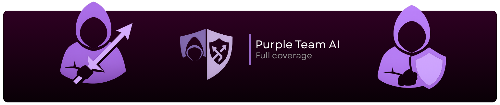

  

  # PurpleTeamAI
  
  **The Framework for AI Powered Security Operations**

  
  
  
  
  

  

    <a href="#key-features">Features</a> •
    <a href="#architecture">Architecture</a> •
    <a href="#getting-started">Getting Started</a> •
    <a href="#roadmap">Roadmap</a> •
    <a href="#contributing">Contributing</a>
  

PurpleTeamAI is a comprehensive security suite that I am developing for my final year dissertation project as part of my Cybersecurity and Digital Forensics course. The aim is to combine reconnaissance, red teaming (offensive), and blue teaming (defensive) operations into a single, unified application creating a complete 'Purple Team' suite.

This project bridges the gap between attackers and defenders by integrating these distinct disciplines into one dashboard. It is not just about attacking; it covers the entire lifecycle from reconnaissance to pentesting and active defence. I am designing this for security researchers to demonstrate how Artificial Intelligence can assist with vulnerability analysis and remediation, utilising Large Language Models (LLMs) to identify security flaws and suggest real time fixes.

## Key Features

### Recon Module
This part handles the initial information gathering. It performs tasks like automated subdomain enumeration and port scanning. It also maps out the attack surface so you can see what assets are exposed. I am also integrating some OSINT tools to pull in data from other sources.

### Pentesting Module
This is the offensive side. It integrates vulnerability scanners and can help map findings to the MITRE ATT&CK framework. There's an AI agent that tries to identify logic flaws and suggest potential ways an attacker might get in.

### Defense Module
This is the defensive side. It's meant for monitoring threats and analysing logs in real time. The cool part is the auto remediation, where the AI suggests fixes for the vulnerabilities it finds. It also checks for compliance with security benchmarks.

### AI Engine
This is the brain of the operation. It analyses data from all the other modules to give a better picture of the security posture. It calculates risk scores and can generate reports in plain English, so you don't have to decipher raw logs.

## Architecture

I am using a modern tech stack for this project:

- **Frontend**: React 18 with TypeScript and Vite. I am using a dark themed dashboard.
- **Backend**: FastAPI (Python) with PostgreSQL for the database.
- **Task Queue**: Celery and Redis to handle the long running scans.
- **AI Integration**: It supports OpenAI, Gemini, and local models via Ollama.
- **Infrastructure**: Everything is dockerised so it's easy to spin up.

## Roadmap

- [x] **Phase 1: Foundation** - Setting up the core architecture, database, and dashboard.
- [ ] **Phase 2: Recon Module** - Integrating the scanning tools.
- [ ] **Phase 3: Pentesting Module** - Adding vulnerability scanning.
- [ ] **Phase 4: Defense Module** - Implementing threat monitoring and remediation.
- [ ] **Phase 5: Integration & Polish** - Tying it all together with the AI engine.

